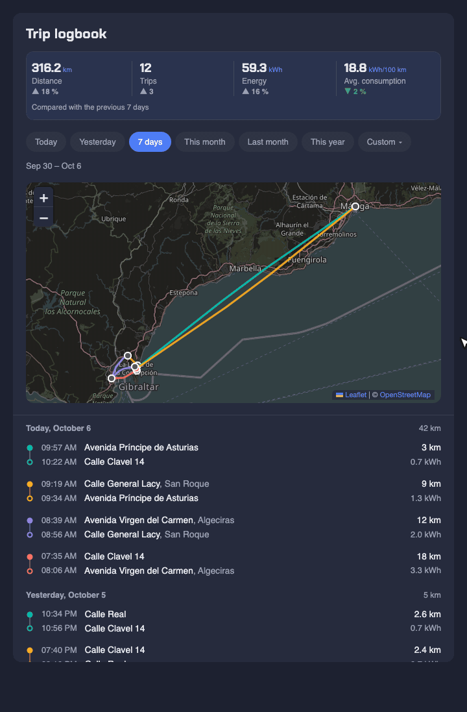
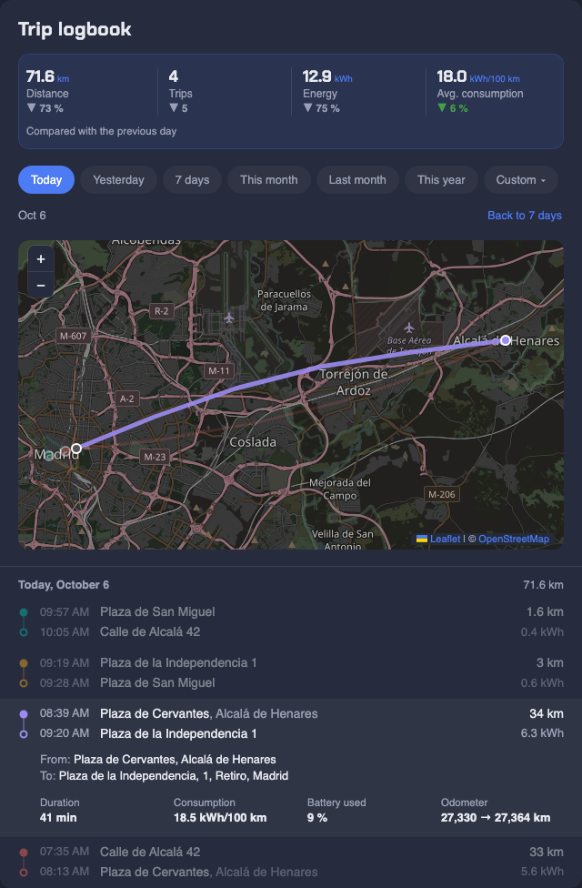
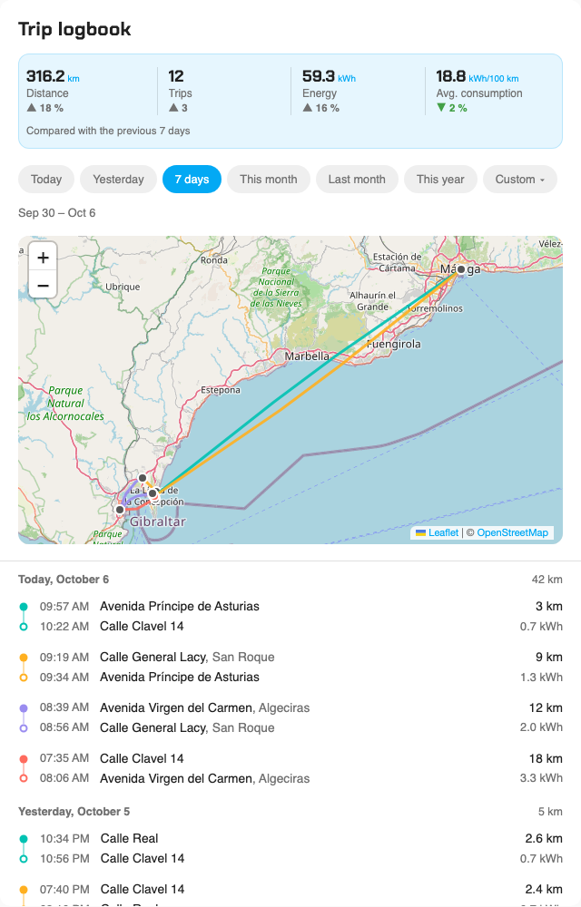

# Mercedes Trips for Home Assistant

[](https://github.com/hacs/integration)
[](https://github.com/dortizesquivel/mercedes-logbook/releases)
[](https://github.com/dortizesquivel/mercedes-logbook/actions/workflows/validate.yml)
[](LICENSE)
[](https://www.home-assistant.io/)

Automatically log every trip of your Mercedes electric or plug-in hybrid in Home Assistant: start and end time, distance, energy used, the GPS route and the start/end addresses, kept in a local SQLite database that the recorder never purges.

It comes with a dashboard card: every trip on a map, quick period filters, a logbook grouped by day and stats compared with the previous period.

<p align="center">
  
</p>

| Dark theme, one trip opened | Light theme, last 7 days |
|---|---|
|  |  |

---

## ⚠️ Required dependency: mbapi2020

**This integration reads its data from [mbapi2020](https://github.com/ReneNulschDE/mbapi2020)** (Mercedes me), a separate HACS integration that connects your car to Home Assistant. Install and set it up first.

Mercedes Trips doesn't replace it or talk to Mercedes itself: mbapi2020 shows the car's live state, and Mercedes Trips turns the changes in that state into a logbook of trips with their routes, energy and history. It uses these mbapi2020 entities:

| Entity | Example entity ID |
|---|---|
| Odometer | `sensor.<car>_odometer` |
| GPS tracker | `device_tracker.<car>_device_tracker` |
| State of charge | `sensor.<car>_state_of_charge` |
| Electric range (optional) | `sensor.<car>_range_electric` |

`<car>` is the name mbapi2020 gives your car, for example `eqb_300` or your licence plate.

**How to install mbapi2020:**
1. Open HACS and search for **Mercedes me API** (or add `https://github.com/ReneNulschDE/mbapi2020` as a custom repository of type **Integration**)
2. Install it and restart Home Assistant
3. Go to **Settings → Devices & services → Add integration → Mercedes me API** and log in with your Mercedes me account

---

## Features

- 🗺️ **Map of every trip**, each in its own color, on OpenStreetMap — darkened when Home Assistant is in dark mode
- 📅 **Quick periods** (today, yesterday, 7 days, this month, last month, this year) plus a custom date and hour range
- 📊 **Stats for the period** — distance, trips, energy and average consumption, each compared with the period right before it
- 📒 **Logbook by day** — start/end time and street, km and kWh; open a trip for full addresses, duration, consumption, battery used and odometer
- ⚡ **Real energy use** from the drop in state of charge and your battery's usable capacity
- 📍 **Addresses** for the start and end of each trip, from OpenStreetMap's Nominatim (no API key), cached locally
- 🔄 **Odometer-based detection** — each stop (shopping, school, work) splits the drive into separate trips
- 🧭 **GPS route** recorded every 30 seconds while driving
- 🌍 **English and Spanish**, following each Home Assistant user's language; dates, numbers and the 12/24-hour clock follow their profile settings
- 💾 **Local SQLite database** and a small REST API to query it
- 📈 **7 sensors** — distance this month/year, energy this month, average consumption, total trips, last trip and trip in progress

---

## Requirements

- Home Assistant 2026.3 or newer
- [HACS](https://hacs.xyz/)
- [mbapi2020](https://github.com/ReneNulschDE/mbapi2020) set up (see above)
- A Mercedes electric or plug-in hybrid with an active Mercedes me connect subscription

---

## Installation

### Via HACS (recommended)

[](https://my.home-assistant.io/redirect/hacs_repository/?owner=dortizesquivel&repository=mercedes-logbook&category=integration)

Or by hand:

1. Open HACS in Home Assistant
2. Open the **⋮** menu → **Custom repositories**
3. Add `dortizesquivel/mercedes-logbook` with type **Integration**
4. Find **Mercedes Trips**, install it and restart Home Assistant

The dashboard card is registered automatically when the integration loads; there is no resource to add by hand.

### Manual

1. Download the [latest release](https://github.com/dortizesquivel/mercedes-logbook/releases)
2. Copy `custom_components/mercedes_trips/` into your `/config/custom_components/` folder
3. Restart Home Assistant

---

## Configuration

1. Go to **Settings → Devices & services → + Add integration**
2. Search for **Mercedes Trips**
3. Check the form. If mbapi2020 is set up, your car's entities are already selected; with several cars, the first one found is picked, so check it is the right one.

| Field | Description | Default |
|---|---|---|
| Odometer sensor | The car's odometer from mbapi2020. Trips start and end on its changes | detected |
| GPS tracker | The car's `device_tracker`, for the route and the addresses | detected |
| Battery level sensor (SoC %) | State of charge, used to work out the energy of each trip | detected |
| Electric range sensor | Optional | detected |
| Usable battery capacity (kWh) | Usable (net) capacity of **your** car — see the table below | none, required |
| Inactivity timeout (minutes) | Minutes without the odometer changing before a trip is closed | `8` |
| Minimum trip distance (km) | Shorter trips are discarded as GPS/odometer noise | `0.5` |

Everything can be changed later from the integration's **Configure** button.

If your Mercedes me account reports the odometer in miles, it is converted to km when trips are stored. The distance sensors follow your Home Assistant unit system; the card always shows km.

---

## Dashboard card

Add it from the card picker (**Mercedes Trips**) or in YAML:

```yaml
type: custom:mercedes-trips-card
title: My logbook  # optional — defaults to "Trip logbook" / "Cuaderno de ruta"
```

### Using the card

- **Pick a period** with the chips under the stats. **7 days** is the default; **Back to 7 days** returns there from any other period.
- **Custom** opens a date range and an hour range — for example only the trips that started between 18:00 and 23:00.
- **Open a trip** by clicking it in the list or its line on the map: the map zooms to it, dims the others and the details open under the trip. Click it again to see every trip again.
- **The stats** cover the chosen period and show the change against the same number of days just before it. Lower consumption shows in green, higher in red; distance and trips stay neutral.
- **Theme and language** follow Home Assistant: dark tiles in dark mode, English or Spanish text from your profile.
- The card adapts to its own width, so it works in a narrow sections column and on a phone.

---

## Sensors

| Entity | Description |
|---|---|
| `sensor.mercedes_trips_distance_this_month` | km driven in the current month |
| `sensor.mercedes_trips_distance_this_year` | km driven in the current year |
| `sensor.mercedes_trips_energy_used_this_month` | kWh used in the current month |
| `sensor.mercedes_trips_average_consumption_this_month` | Average consumption in kWh/100 km (current month) |
| `sensor.mercedes_trips_total_trips` | Number of trips logged |
| `sensor.mercedes_trips_last_trip` | Last trip as "start → end", with all its data as attributes |
| `sensor.mercedes_trips_trip_in_progress` | `active` / `idle`, with the live trip as attributes |

Names are shown in your language. Installs from before v1.4.0 keep their original (Spanish) entity IDs, such as `sensor.mercedes_trips_distancia_este_mes`.

---

## REST API

The integration exposes an internal endpoint for querying trips:

```
GET /api/mercedes_trips/trips
```

**Query parameters:**

| Parameter | Type | Description |
|---|---|---|
| `start_date` | `YYYY-MM-DD` | Filter from this date |
| `end_date` | `YYYY-MM-DD` | Filter up to this date |
| `hour_start` | `0–23` | Minimum trip start hour |
| `hour_end` | `0–23` | Maximum trip start hour |
| `limit` | int | Max results (default 200) |
| `offset` | int | Pagination offset |

**Example:**
```bash
curl -H "Authorization: Bearer YOUR_TOKEN" \
  "http://homeassistant.local:8123/api/mercedes_trips/trips?start_date=2026-07-01&limit=10"
```

**Response:**
```json
{
  "trips": [
    {
      "id": 1,
      "start_time": "2026-07-12T10:00:00",
      "end_time": "2026-07-12T10:23:00",
      "distance_km": 15.4,
      "kwh_used": 3.2,
      "avg_kwh_per_100km": 20.8,
      "start_address": "Calle de Alcalá, 42, Centro, Madrid",
      "end_address": "Plaza de Cervantes, Alcalá de Henares",
      "waypoints": [[40.4183, -3.6966, "2026-07-12T10:00:00"], "..."]
    }
  ],
  "stats": {
    "distance_this_month": 342.5,
    "kwh_this_month": 71.3,
    "avg_kwh_per_100km": 20.8,
    "total_trips": 28
  }
}
```

---

**Other endpoints:**

| Endpoint | Returns |
|---|---|
| `GET /api/mercedes_trips/trips/{id}` | One trip, with its waypoints |
| `GET /api/mercedes_trips/totals` | `trip_count`, `distance_km` and `kwh_used` for the same `start_date` / `end_date` / `hour_start` / `hour_end` filters, without waypoints |

Hours are the local time the trip started.

---

## Database

Trips are stored in `/config/mercedes_trips.db` (SQLite). You can query it directly:

```bash
sqlite3 /config/mercedes_trips.db \
  "SELECT start_time, distance_km, kwh_used, start_address, end_address FROM trips ORDER BY start_time DESC LIMIT 10;"
```

---

## Battery capacity by model

Approximate usable capacities; check the spec sheet for your model year, as they changed between versions.

| Model | Usable kWh |
|---|---|
| EQA 250 / 250+ / 300 / 350 | 66.5 kWh |
| EQB 250 / 300 / 350 | 66.5 kWh |
| EQC 400 | 80.0 kWh |
| EQE 300 / 350 / 500 | 90.6 kWh |
| EQS 450 / 580 | 107.8 kWh |
| GLC 300e PHEV | 17.6 kWh |
| C 300e PHEV | 17.6 kWh |

---

## Troubleshooting

**No trips appear:**
- Check that the odometer changes in **Developer tools → States** while driving
- Make sure mbapi2020 is connected and its entities aren't `unavailable`
- Check **Settings → System → Logs**, filtering by `mercedes_trips`

**The card shows "Configuration error" or "Custom element doesn't exist":**
- If you opened the dashboard while Home Assistant was still starting, reload the page once it has started: a page loaded before the integration is up doesn't have the card yet
- Otherwise hard-refresh the browser (`Ctrl+Shift+R`, or `Cmd+Shift+R` on a Mac)
- Check that **Settings → Devices & services → Mercedes Trips** shows the integration as loaded

**Energy is not calculated:**
- The state of charge sensor must have a value (not `unknown`) at the start and end of the trip
- Check the battery capacity in the integration options
- If the car goes to sleep before reporting its final state of charge, that trip has no energy figure

**mbapi2020 entities aren't pre-selected:**
- Pick them by hand in the form; look up their IDs in mbapi2020's device page

---

## How it works

1. **Trip start**: the odometer increases while no trip is in progress
2. **While driving**: a GPS point is recorded every 30 seconds, and every odometer change counts as movement
3. **Trip end**: every 2 minutes a check closes the trip if the odometer hasn't changed for the configured timeout
4. **After the trip**: distance and kWh are calculated, the start and end are geocoded and the trip is saved to SQLite
5. **Noise filtering**: trips shorter than the minimum distance are discarded

**What leaves your Home Assistant:** the start and end coordinates of each trip go to OpenStreetMap's Nominatim to get the addresses (once per place, then cached), and the card loads its map tiles from OpenStreetMap. Nothing else is sent anywhere: Leaflet and the card's font ship with the integration.

**Limitations:** one car per Home Assistant install, and the card shows distances in km.

---

## Development

`test/demo.html` runs the card in a plain browser with sample trips, no Home Assistant needed:

```bash
python3 -m http.server 8765
# http://localhost:8765/test/demo.html — add ?lang=en, ?theme=light or ?w=360 (phone width)
```

Every push runs [Validate](.github/workflows/validate.yml): the HACS action, hassfest, and checks on the Python code, the card JS and the translations. Releases go through the [Release](.github/workflows/release.yml) workflow (**Actions → Release → Run workflow**, or `gh workflow run release.yml -f bump=minor`), which bumps the version in `manifest.json`, updates [CHANGELOG.md](CHANGELOG.md), tags and publishes the GitHub release that HACS installs from.

---

## Contributing

Issues and PRs are welcome at [github.com/dortizesquivel/mercedes-logbook](https://github.com/dortizesquivel/mercedes-logbook).

---

## License

MIT — see [LICENSE](LICENSE)
